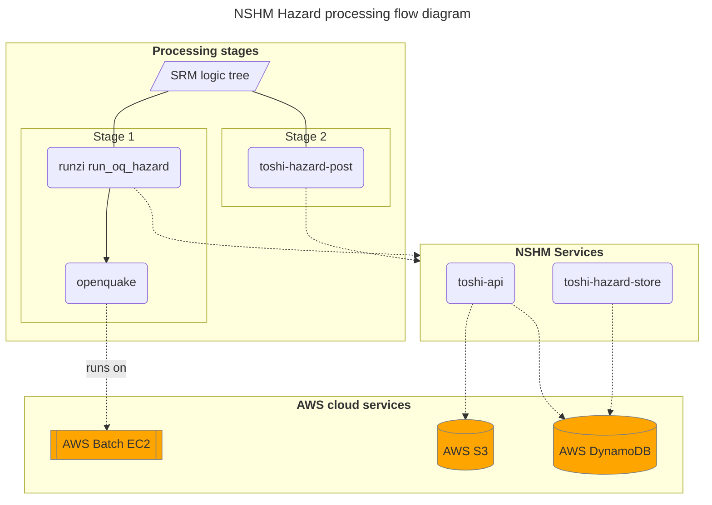

```mermaid
---
title: NSHM Hazard processing flow diagram
---
%%{init: {'flowchart' : {'curve' : 'basis'}}}%%
flowchart TB
    
    subgraph "`**AWS cloud services**`"
        direction TB
        batch[[AWS Batch EC2]]
        s3[(AWS S3)]
        dynamoDB[(AWS DynamoDB)]
        class batch,s3,dynamoDB AWS;
        classDef AWS fill:orange, stroke:gray,stroke-width:1px;
    end

    subgraph X["`**NSHM Services**`"]
        ths(toshi-hazard-store)
        tapi(toshi-api)
    end        

    subgraph "`**Processing stages**`" 
        slt[/SRM logic tree/]
        subgraph Stage 1
         roh(runzi run_oq_hazard)
         oq( openquake )
         roh --> oq
        end

        subgraph Stage  2
         thp(toshi-hazard-post)
         end
    end

        %% links
    slt --- roh
    slt --- thp
    tapi -.-> dynamoDB
    tapi -.-> s3
    ths -.-> dynamoDB
    oq -. runs on .-> batch
    roh -.-> X
    thp -.-> X 
```