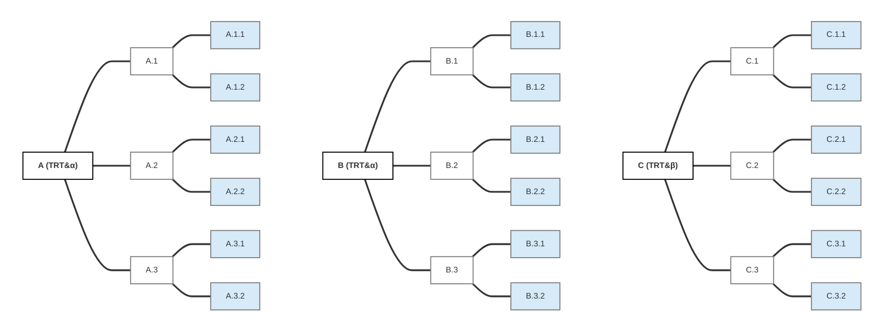

```mermaid
%%{ init: { 'flowchart': { 'curve': 'monotoneX' } } }%%
flowchart
    classDef node fill: #d6eaf8 , stroke:gray,stroke-width:2px;
    classDef box fill:white, stroke:black,stroke-width:2px;
    classDef box2 fill:white, stroke:gray,stroke-width:2px;
    classDef doc fill:#ffcfc4;
    classDef ltc fill:white, stroke:black,stroke-width:0px;


    subgraph LTC[ ]
        direction LR
        C["`**C (TRT&#946;)**`"]:::box
        C1[C.1]:::box2
        C2[C.2]:::box2
        C3[C.3]:::box2
        C11[C.1.1]
        C12[C.1.2]
        C21[C.2.1]
        C22[C.2.2]
        C31[C.3.1]
        C32[C.3.2]
    end

    subgraph LTB[ ]
        direction LR
        B["`**B (TRT&#945;)**`"]:::box
        B1[B.1]:::box2
        B2[B.2]:::box2
        B3[B.3]:::box2
        B11[B.1.1]
        B12[B.1.2]
        B21[B.2.1]
        B22[B.2.2]
        B31[B.3.1]
        B32[B.3.2]
    end

    subgraph LTA[ ]
        direction LR
        A["`**A (TRT&#945;)**`"]:::box
        A1[A.1]:::box2
        A2[A.2]:::box2
        A3[A.3]:::box2
        A11[A.1.1]
        A12[A.1.2]
        A21[A.2.1]
        A22[A.2.2]
        A31[A.3.1]
        A32[A.3.2]
    end

    class LTA,LTB,LTC ltc

    %% links
    A === A1
    A === A2
    A === A3
    A1 === A11
    A1 === A12
    A2 === A21
    A2 === A22
    A3 === A31
    A3 === A32
    
    B === B1
    B === B2
    B === B3
    B1 === B11
    B1 === B12
    B2 === B21
    B2 === B22
    B3 === B31
    B3 === B32
    
    C === C1
    C === C2
    C === C3
    C1 === C11
    C1 === C12
    C2 === C21
    C2 === C22
    C3 === C31
    C3 === C32
```